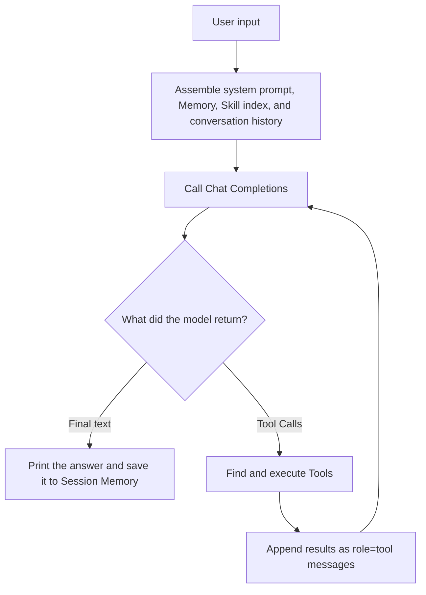

# mini-agent

A Python command-line project for learning how AI agents work.

`mini-agent` does not depend on agent frameworks such as LangChain, AutoGen, or CrewAI. Instead, it implements a complete agent with deliberately small and straightforward code: the model can decide what to do next, select tools, load skills, and access external capabilities through MCP.

The goal is not to “build a feature-rich assistant as quickly as possible.” The goal is to help developers truly understand:

- why an agent is more than a single LLM request;
- what a Tool is and how the model selects and calls one;
- how a Skill differs from a Tool and why progressive disclosure matters;
- how MCP connects external capabilities to an agent;
- how memory, context, and safety boundaries affect an agent run.

The project uses the official OpenAI Python SDK and the Chat Completions protocol. It can also connect to compatible providers that support this protocol.

## Start with the Three Core Concepts

| Concept | Problem it solves | Implementation in this project |
| --- | --- | --- |
| **Tool** | How an agent performs actions or obtains information the model does not know | A Python object with a name, description, parameter schema, and `run()` method |
| **Skill** | How an agent obtains task-specific procedures and domain knowledge on demand | `skills/*/SKILL.md`, progressively loaded through `load_skill` |
| **MCP** | How an agent connects to external tools and services through a common protocol | Connects to stdio MCP servers and adapts their tools into the Tool Registry |

A simple way to think about them:

- **A Tool is a hand**: it reads files, searches text, or runs commands to perform a real action.
- **A Skill is experience**: it tells the agent which steps to follow and which references to use for a class of tasks.
- **MCP is an interface standard**: it lets external services expose Tools to an agent in a consistent way.

A Skill usually does not perform an action itself, and MCP is not a different kind of Agent Loop. Built-in Tools and MCP Tools ultimately enter the same Tool Registry and are orchestrated by the same Agent Loop.

## How the Agent Runs

One user request may trigger multiple model calls:



This cycle—model decides the next step, the program executes it, the result goes back to the model, and the model decides again—is the Agent Loop and the first part of the project worth understanding.

## Quick Start

### 1. Prepare the Environment

Python 3.10 or newer is required. Python 3.12 is recommended.

```bash
git clone <your-repository-url>
cd mini-agent

python3 -m venv .venv
source .venv/bin/activate
pip install -e ".[dev]"
```

Activate the virtual environment in Windows PowerShell with:

```powershell
.venv\Scripts\Activate.ps1
```

### 2. Configure a Model (any Chat Completions compatible service)
```bash
export MINIAGENT_BASE_URL="https://api.deepseek.com"
export MINIAGENT_MODEL="your-deepseek-model"
export MINIAGENT_API_KEY="your-api-key"
```

Never put a real API key in source code, documentation examples, or Git commits.
### 3. Start the Agent

Start an interactive chat:

```bash
.venv/bin/miniagent
```

After activating the virtual environment, you can also run:

```bash
miniagent
```

Run one task and exit:

```bash
miniagent run "Read pyproject.toml and explain which dependencies this project uses"
```

For your first exploration, try these prompts in order:

```text
Reply with only: Hello
Read pyproject.toml and summarize the project dependencies
Search for the code that registers Tools and explain the registration process
Use the python-tutor skill to design a practice project for a Python beginner
```

These four tasks let you observe a plain response, Tool Calling, composition of multiple Tools, and on-demand Skill loading.

### 4. Verify the Installation

These commands do not call the model:

```bash
miniagent config show
miniagent tools list
miniagent skills list
miniagent mcp list
```

In a development environment, you can also run the test suite:

```bash
.venv/bin/python -m pytest
```

## Recommended Learning Path

Do not start by reading every source file. Follow the path that one real request takes through the project.

### Stage 1: Understand the Minimal Agent Loop

Read these files first:

1. `src/miniagent/agent/loop.py`
2. `src/miniagent/llm/client.py`
3. `tests/unit/test_agent_loop.py`

Try to answer these questions:

- Why might one `Agent.run()` call invoke the model multiple times?
- What does the `tool_calls` structure returned by the model look like?
- Why must a Tool result be sent back to the model with `role="tool"`?
- Why is `max_iterations` necessary?
- In streaming mode, why must the complete Tool arguments be assembled before execution?

Set a breakpoint in `test_agent_executes_tool_call`. The test uses a fake LLM, so it demonstrates the entire “model requests Tool → Tool executes → model returns answer” flow without consuming API tokens.

### Stage 2: Understand Tools

Continue with:

1. `src/miniagent/tools/base.py`: the Tool protocol, runtime context, and result structure;
2. `src/miniagent/tools/registry.py`: Tool registration, lookup, and schema export;
3. `src/miniagent/tools/files.py`: concrete file Tool implementations;
4. `src/miniagent/tools/shell.py`: command execution and safety restrictions;
5. `src/miniagent/tools/__init__.py`: the central built-in Tool registration point.

A Tool must provide at least:

```python
class ExampleTool:
    name = "example"
    description = "Explain clearly when the model should use this tool."
    parameters_schema = {
        "type": "object",
        "properties": {
            "text": {"type": "string"},
        },
        "required": ["text"],
    }

    def run(self, arguments, context):
        return ToolResult(ok=True, content=arguments["text"])
```

The most important point is that **the model does not run a Python function directly**. The program sends Tool schemas to the model; the model generates a Tool Call; the Agent validates its arguments, finds and executes the Tool, then sends the result back to the model.

Exercise: copy the `EchoTool` from the tests, turn it into a string-length Tool, add unit tests, and register it in `create_builtin_registry()`.

### Stage 3: Understand Skills

Read:

1. `skills/python-tutor/SKILL.md`: the example Skill;
2. `src/miniagent/skills/loader.py`: Skill discovery and resource loading;
3. `src/miniagent/tools/skill_tools.py`: how the model loads a Skill through a Tool;
4. `tests/unit/test_skills.py`: progressive loading and path-safety tests.

The basic Skill directory structure is:

```text
skills/python-tutor/
├── SKILL.md
└── references/
    ├── beginner-project.md
    └── code-review-checklist.md
```

The minimal `SKILL.md` format is:

```markdown
---
name: python-tutor
description: Helps beginners learn Python by building small command-line projects.
---

Write the steps and rules the Agent should follow for this class of tasks here.
```

The project uses progressive disclosure:

1. Startup scans only `skills/*/SKILL.md`;
2. only `name` and `description` enter the model context by default;
3. when the model decides a Skill is relevant, it calls `load_skill`;
4. the first load returns the complete instructions and available resource list;
5. when more information is needed, a specific reference is loaded separately.

This avoids putting every Skill body into the context up front and makes Skill activation easier to observe.

Exercise: create `skills/code-reviewer/SKILL.md`, define when it should be used, its review procedure, and its output format, then run `miniagent skills list` to verify discovery.

### Stage 4: Understand MCP

Read:

1. `src/miniagent/mcp/client.py`: stdio MCP server connections, Tool discovery, and invocation;
2. `src/miniagent/mcp/adapter.py`: adaptation from MCP Tools to the project Tool interface;
3. `src/miniagent/agent/factory.py`: how built-in Tools, Skills, and MCP Tools are assembled into one Agent.

The key value of MCP is a common protocol. The Agent does not need a new calling convention for every external service. It only needs to:

1. retrieve Tool names, descriptions, and input schemas from an MCP server;
2. adapt them into the project's internal Tool interface;
3. register them in the Tool Registry;
4. invoke them through the MCP Client when the model produces a call.

v1 supports stdio MCP servers and disables MCP by default. Create `~/.miniagent/mcp.json`:

```json
{
  "servers": {
    "example": {
      "transport": "stdio",
      "command": "your-mcp-server-command",
      "args": [],
      "env": {}
    }
  }
}
```

Then enable MCP:

```bash
export MINIAGENT_MCP_ENABLED=true
miniagent
```

MCP Tools use the name `mcp__<server>__<tool>` to avoid collisions with built-in Tools. To keep lifecycle behavior easy to understand, v1 creates a short-lived stdio session for every discovery or invocation. This is appropriate for a learning implementation, not the final design for high-throughput workloads.

Exercise: connect a simple MCP server, then run `miniagent mcp list` and `/tools` in interactive mode. Observe the difference between “configured servers” and “Tools actually registered for the model.”

### Stage 5: Complete the Picture with Memory, Configuration, and Safety Boundaries

Finally, read:

- `src/miniagent/memory/`: conversation messages, persistent memory, and JSONL storage;
- `src/miniagent/config/`: defaults, environment variables, and configuration precedence;
- `src/miniagent/tools/shell.py`: shell command classification, confirmation, and denial policies;
- `src/miniagent/agent/context.py`: how runtime dependencies are passed around together.

Consider what would happen if an Agent could run arbitrary commands, access any path, loop forever, or insert every byte of Tool output into its context. A usable Agent needs more than capabilities: it also needs timeouts, scope restrictions, output truncation, confirmation mechanisms, and a maximum loop count.

## Project Structure

```text
mini-agent/
├── src/miniagent/
│   ├── agent/       # Agent Loop, runtime context, and assembly entry point
│   ├── llm/         # Chat Completions client and streaming protocol
│   ├── tools/       # Tool protocol, registry, and built-in Tools
│   ├── skills/      # Skill discovery and progressive loading
│   ├── mcp/         # MCP client and Tool adapter
│   ├── memory/      # Session Memory and persistence
│   ├── config/      # Configuration model and precedence
│   └── cli/         # Commands, REPL, and terminal output
├── skills/          # Local Skills intended for learning and modification
├── tests/           # Unit and integration tests
└── pyproject.toml
```

## Built-in Tools

All built-in Tools are registered and exposed to the model by default:

| Tool | Purpose |
| --- | --- |
| `read_file` | Read a text file inside the workspace |
| `write_file` | Create or completely overwrite a file |
| `edit_file` | Replace an exact segment in an existing file |
| `search_text` | Search the workspace with text or a regular expression |
| `run_shell` | Synchronously run a shell command after safety checks |
| `load_skill` | Load Skill instructions or a resource file on demand |

The project does not provide `list_files`; file discovery uses `search_text` or the restricted `run_shell`. File operations are limited to `workspace_root`; sensitive shell commands require confirmation, and clearly dangerous commands are denied.

## CLI Reference

Common commands:

```bash
miniagent                              # Interactive mode
miniagent run "your task"             # One-shot task
miniagent config show                  # Show effective config without the API key
miniagent tools list                   # Show built-in Tools
miniagent skills list                  # Show discovered Skill metadata
miniagent mcp list                     # Show configured MCP servers
miniagent memory list                  # Show saved Sessions
miniagent memory clear                 # Clear saved Sessions and persistent memory
```

Interactive commands:

```text
/help
/exit
/clear
/new
/model [name]
/language [code]
/config
/tools
/skills
/mcp
/memory
/save
/stream on|off
/markdown on|off
```

## Configuration

Configuration precedence:

```text
CLI arguments > environment variables > ~/.miniagent/config.toml > defaults
```

Example configuration file:

```toml
api_key = "your-api-key"
model = "your-model-name"
base_url = "https://your-provider.example/v1"
default_language = "zh-CN"
stream = true
render_markdown = true
temperature = 0.2
max_iterations = 8
workspace_root = "/path/to/your/workspace"
skills_dir = "/path/to/your/workspace/skills"
mcp_enabled = false
```

For a real API key, prefer the `MINIAGENT_API_KEY` environment variable over the configuration file.

| Key | Environment variable | Default | Description |
| --- | --- | --- | --- |
| `api_key` | `MINIAGENT_API_KEY` | none | Required service API key |
| `model` | `MINIAGENT_MODEL` | none | Required Chat Completions model name |
| `base_url` | `MINIAGENT_BASE_URL` | SDK default | Compatible service URL |
| `default_language` | `MINIAGENT_DEFAULT_LANGUAGE` | `zh-CN` | Default response language |
| `stream` | `MINIAGENT_STREAM` | `true` | Whether to stream output |
| `render_markdown` | `MINIAGENT_RENDER_MARKDOWN` | `true` | Whether to render Markdown |
| `temperature` | `MINIAGENT_TEMPERATURE` | `0.2` | Sampling temperature |
| `max_iterations` | `MINIAGENT_MAX_ITERATIONS` | `8` | Maximum loop count per request |
| `workspace_root` | `MINIAGENT_WORKSPACE` | current directory | Workspace for file and shell Tools |
| `skills_dir` | `MINIAGENT_SKILLS_DIR` | `./skills` | Skill directory |
| `tool_timeout` | `MINIAGENT_TOOL_TIMEOUT` | `30` | General Tool timeout in seconds |
| `shell_timeout` | `MINIAGENT_SHELL_TIMEOUT` | `60` | Shell Tool timeout in seconds |
| `mcp_enabled` | `MINIAGENT_MCP_ENABLED` | `false` | Whether to enable MCP |
| `mcp_config_path` | `MINIAGENT_MCP_CONFIG` | `~/.miniagent/mcp.json` | MCP configuration path |

## Development and Verification

```bash
.venv/bin/python -m compileall src tests
.venv/bin/python -m pytest
```

If you want to extend the project, a good order is: write a test for the behavior, implement one small Tool or Skill, and modify the Agent Loop only when necessary. The Agent Loop is the orchestration core; keeping it small and explicit has more educational value than layering on abstractions.

## Project Boundaries

- Uses the official OpenAI Python SDK, but calls Chat Completions only and does not use the Responses API;
- implements the Agent Loop, Tool Registry, built-in Tools, Memory, and Skill loading locally;
- keeps `run_shell` synchronous in v1;
- supports only the stdio transport for MCP in v1;
- prioritizes clear code, testable behavior, and understandable safety boundaries as a teaching implementation.
