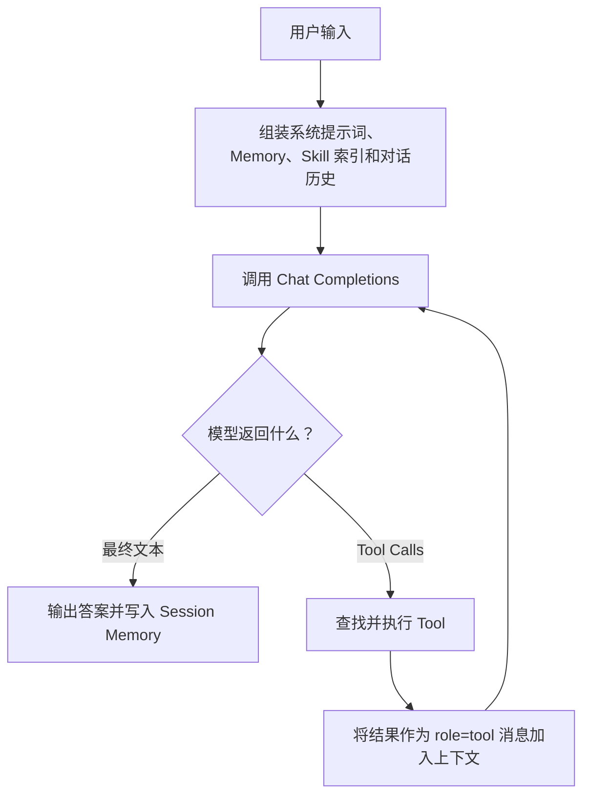

# mini-agent

一个用来学习 AI Agent 工作原理的 Python 命令行项目。

`mini-agent` 不依赖 LangChain、AutoGen、CrewAI 等 Agent 框架，而是用尽量少、尽量直白的代码实现一套完整的 Agent：模型可以思考下一步、选择工具、读取 Skill，并通过 MCP 使用外部能力。

这个项目关注的不是“快速搭建一个功能很多的助手”，而是帮助开发者真正理解：

- Agent 为什么不只是一次 LLM 请求；
- Tool 是什么，模型如何选择并调用 Tool；
- Skill 和 Tool 有什么区别，为什么要渐进式加载；
- MCP 如何把外部服务的能力接入 Agent；
- Memory、上下文、安全边界如何参与一次 Agent 运行。

项目使用 OpenAI 官方 Python SDK 和 Chat Completions 协议，也可以连接支持该协议的兼容服务。

## 先理解三个核心概念

| 概念 | 它解决的问题 | 在本项目中的实现 |
| --- | --- | --- |
| **Tool** | Agent 如何执行动作、获取模型自身不知道的信息 | Python 对象，包含名称、描述、参数 Schema 和 `run()` 方法 |
| **Skill** | Agent 如何按需获得某类任务的操作方法和领域知识 | `skills/*/SKILL.md`，通过 `load_skill` 渐进加载 |
| **MCP** | Agent 如何用统一协议连接外部工具和服务 | 连接 stdio MCP Server，并将其工具适配到 Tool Registry |

可以把它们简单理解为：

- **Tool 是手**：读取文件、搜索文本、运行命令，真正执行一个动作。
- **Skill 是经验**：告诉 Agent 面对某类任务时应该遵循什么步骤、参考哪些资料。
- **MCP 是接口标准**：让外部服务用统一方式把 Tool 提供给 Agent。

Skill 本身通常不会直接执行动作；MCP 也不是一种新的 Agent Loop。最终，内置 Tool 和 MCP Tool 都会进入同一个 Tool Registry，由 Agent Loop 统一调度。

## Agent 是怎样运行的

一次用户请求可能触发多轮模型调用：



这个“模型决定下一步 → 程序执行 → 结果返回模型 → 模型继续决定”的循环，就是 Agent Loop，也是最值得先读懂的部分。

## 快速开始

### 1. 准备环境

需要 Python 3.10 或更高版本，推荐 Python 3.12。

```bash
git clone <your-repository-url>
cd mini-agent

python3 -m venv .venv
source .venv/bin/activate
pip install -e ".[dev]"
```

Windows PowerShell 激活虚拟环境：

```powershell
.venv\Scripts\Activate.ps1
```

### 2. 配置模型（兼容 Chat Completions 的服务均可）
```bash
export MINIAGENT_BASE_URL="https://api.deepseek.com"
export MINIAGENT_MODEL="your-deepseek-model"
export MINIAGENT_API_KEY="your-api-key"
```

不要把真实 API Key 写进代码、配置示例或提交到 Git。
### 3. 启动 Agent

进入交互式对话：

```bash
.venv/bin/miniagent
```

也可以激活虚拟环境后直接运行：

```bash
miniagent
```

执行一个任务后退出：

```bash
miniagent run "阅读 pyproject.toml，并说明这个项目使用了哪些依赖"
```

第一次体验建议依次尝试：

```text
只回答：你好
读取 pyproject.toml，总结项目依赖
搜索项目中注册 Tool 的代码，并解释注册过程
请使用 python-tutor skill，为 Python 初学者设计一个练习项目
```

这四个任务分别帮助你观察：普通回复、Tool Calling、多个 Tool 的组合，以及 Skill 的按需加载。

### 4. 确认安装是否正常

下面这些命令不需要调用模型：

```bash
miniagent config show
miniagent tools list
miniagent skills list
miniagent mcp list
```

开发环境还可以运行测试：

```bash
.venv/bin/python -m pytest
```

## 推荐学习路线

不要一开始就通读所有源码。建议按照一次请求实际经过的路径学习。

### 第一阶段：读懂最小 Agent Loop

先阅读：

1. `src/miniagent/agent/loop.py`
2. `src/miniagent/llm/client.py`
3. `tests/unit/test_agent_loop.py`

重点回答这些问题：

- 为什么一次 `Agent.run()` 可能调用模型多次？
- 模型返回的 `tool_calls` 是什么结构？
- 为什么 Tool 的执行结果要使用 `role="tool"` 再发给模型？
- `max_iterations` 为什么是必要的？
- 流式返回时，为什么要先拼接完整的 Tool 参数再执行？

建议在 `test_agent_executes_tool_call` 中打断点。这个测试使用假的 LLM，能在不消耗 API Token 的情况下展示完整的“模型请求 Tool → 执行 Tool → 模型给出答案”流程。

### 第二阶段：理解 Tool

继续阅读：

1. `src/miniagent/tools/base.py`：Tool 协议、上下文和结果结构；
2. `src/miniagent/tools/registry.py`：Tool 的注册、查找和 Schema 导出；
3. `src/miniagent/tools/files.py`：文件类 Tool 的具体实现；
4. `src/miniagent/tools/shell.py`：命令执行和安全限制；
5. `src/miniagent/tools/__init__.py`：内置 Tool 的统一注册入口。

一个 Tool 至少需要提供：

```python
class ExampleTool:
    name = "example"
    description = "Explain clearly when the model should use this tool."
    parameters_schema = {
        "type": "object",
        "properties": {
            "text": {"type": "string"},
        },
        "required": ["text"],
    }

    def run(self, arguments, context):
        return ToolResult(ok=True, content=arguments["text"])
```

这里最重要的认识是：**模型不会直接运行 Python 函数**。程序只是把 Tool Schema 发给模型；模型生成 Tool Call；Agent 校验参数、找到对应 Tool 并执行，再把结果发回模型。

动手练习：复制测试中的 `EchoTool`，改造成一个字符串长度统计工具，为它补充单元测试，再注册到 `create_builtin_registry()`。

### 第三阶段：理解 Skill

阅读：

1. `skills/python-tutor/SKILL.md`：示例 Skill；
2. `src/miniagent/skills/loader.py`：Skill 的发现和资源加载；
3. `src/miniagent/tools/skill_tools.py`：模型如何通过 Tool 加载 Skill；
4. `tests/unit/test_skills.py`：渐进加载和路径安全测试。

Skill 目录的基本结构：

```text
skills/python-tutor/
├── SKILL.md
└── references/
    ├── beginner-project.md
    └── code-review-checklist.md
```

`SKILL.md` 的最小格式：

```markdown
---
name: python-tutor
description: Helps beginners learn Python by building small command-line projects.
---

这里编写 Agent 在该类任务中应该遵循的步骤和规则。
```

项目采用渐进式披露：

1. 启动时只扫描 `skills/*/SKILL.md`；
2. 默认只把 `name` 和 `description` 放进模型上下文；
3. 模型判断 Skill 相关时，调用 `load_skill`；
4. 首次加载返回完整指令和可用资源列表；
5. 需要更多资料时，再单独加载某个 reference。

这样可以避免把所有 Skill 全文一次性塞进上下文，也让 Skill 的触发过程更容易观察。

动手练习：创建一个 `skills/code-reviewer/SKILL.md`，写清它何时使用、审查步骤和输出格式，然后运行 `miniagent skills list` 检查发现结果。

### 第四阶段：理解 MCP

阅读：

1. `src/miniagent/mcp/client.py`：stdio MCP Server 的连接、工具发现与调用；
2. `src/miniagent/mcp/adapter.py`：MCP Tool 到项目 Tool 接口的适配；
3. `src/miniagent/agent/factory.py`：内置 Tool、Skill 和 MCP Tool 如何组装到一个 Agent。

MCP 的关键价值是协议统一。Agent 不需要为每个外部服务重新设计一套调用方式，只需要：

1. 从 MCP Server 获取工具名称、描述和输入 Schema；
2. 将它们适配为项目内部的 Tool；
3. 注册到 Tool Registry；
4. 在模型产生调用后，通过 MCP Client 执行。

本项目 v1 支持 stdio MCP Server，默认关闭。创建 `~/.miniagent/mcp.json`：

```json
{
  "servers": {
    "example": {
      "transport": "stdio",
      "command": "your-mcp-server-command",
      "args": [],
      "env": {}
    }
  }
}
```

然后启用 MCP：

```bash
export MINIAGENT_MCP_ENABLED=true
miniagent
```

MCP Tool 会使用 `mcp__<server>__<tool>` 命名，以避免和内置 Tool 冲突。v1 为了让生命周期清晰，每次发现或调用都会建立一个短生命周期的 stdio 会话；这是适合学习的实现，不是高吞吐场景的最终方案。

动手练习：接入一个简单的 MCP Server，分别运行 `miniagent mcp list` 和交互模式下的 `/tools`，观察“已配置的 Server”和“真正注册给模型的 Tool”有什么区别。

### 第五阶段：补齐 Memory、配置和安全边界

最后阅读：

- `src/miniagent/memory/`：会话消息、持久记忆和 JSONL 存储；
- `src/miniagent/config/`：默认值、环境变量和配置覆盖顺序；
- `src/miniagent/tools/shell.py`：Shell 命令分类、确认与拒绝策略；
- `src/miniagent/agent/context.py`：运行时依赖如何集中传递。

尝试思考：如果 Agent 能运行任意命令、访问任意路径、无限循环或把全部工具输出塞进上下文，会发生什么？一个可用的 Agent 不只有能力，还必须有超时、范围限制、输出截断、确认机制和最大循环次数。

## 项目结构

```text
mini-agent/
├── src/miniagent/
│   ├── agent/       # Agent Loop、运行时上下文和组装入口
│   ├── llm/         # Chat Completions 客户端与流式协议
│   ├── tools/       # Tool 协议、注册表和内置工具
│   ├── skills/      # Skill 发现与渐进加载
│   ├── mcp/         # MCP 客户端和 Tool 适配器
│   ├── memory/      # Session Memory 与持久化
│   ├── config/      # 配置模型和加载优先级
│   └── cli/         # 命令行、REPL 和终端输出
├── skills/          # 可直接学习和修改的本地 Skill
├── tests/           # 单元测试与集成测试
└── pyproject.toml
```

## 内置 Tool

内置 Tool 默认都会注册并暴露给模型：

| Tool | 作用 |
| --- | --- |
| `read_file` | 读取工作区内的文本文件 |
| `write_file` | 创建或整体覆盖文件 |
| `edit_file` | 精确替换已有文件中的一段文本 |
| `search_text` | 在工作区搜索文本或正则表达式 |
| `run_shell` | 同步执行经过安全检查的 Shell 命令 |
| `load_skill` | 按需加载 Skill 正文或资源文件 |

项目没有提供 `list_files`，文件探索通过 `search_text` 或受限的 `run_shell` 完成。文件操作限制在 `workspace_root`；敏感 Shell 命令需要确认，明显危险的命令会被拒绝。

## CLI 速查

常用命令：

```bash
miniagent                              # 交互模式
miniagent run "your task"             # 单次任务
miniagent config show                  # 查看生效配置，不显示 API Key
miniagent tools list                   # 查看内置 Tool
miniagent skills list                  # 查看已发现的 Skill 索引
miniagent mcp list                     # 查看已配置的 MCP Server
miniagent memory list                  # 查看保存的 Session
miniagent memory clear                 # 清除保存的 Session 和持久记忆
```

交互模式命令：

```text
/help
/exit
/clear
/new
/model [name]
/language [code]
/config
/tools
/skills
/mcp
/memory
/save
/stream on|off
/markdown on|off
```

## 配置

配置优先级：

```text
CLI 参数 > 环境变量 > ~/.miniagent/config.toml > 默认值
```

配置文件示例：

```toml
api_key = "your-api-key"
model = "your-model-name"
base_url = "https://your-provider.example/v1"
default_language = "zh-CN"
stream = true
render_markdown = true
temperature = 0.2
max_iterations = 8
workspace_root = "/path/to/your/workspace"
skills_dir = "/path/to/your/workspace/skills"
mcp_enabled = false
```

建议真实 API Key 使用 `MINIAGENT_API_KEY` 环境变量，而不是写入配置文件。

| 配置项 | 环境变量 | 默认值 | 说明 |
| --- | --- | --- | --- |
| `api_key` | `MINIAGENT_API_KEY` | 无 | 必填，服务 API Key |
| `model` | `MINIAGENT_MODEL` | 无 | 必填，Chat Completions 模型名 |
| `base_url` | `MINIAGENT_BASE_URL` | SDK 默认值 | 兼容服务地址 |
| `default_language` | `MINIAGENT_DEFAULT_LANGUAGE` | `zh-CN` | 默认回答语言 |
| `stream` | `MINIAGENT_STREAM` | `true` | 是否流式输出 |
| `render_markdown` | `MINIAGENT_RENDER_MARKDOWN` | `true` | 是否渲染 Markdown |
| `temperature` | `MINIAGENT_TEMPERATURE` | `0.2` | 采样温度 |
| `max_iterations` | `MINIAGENT_MAX_ITERATIONS` | `8` | 单次请求最大循环次数 |
| `workspace_root` | `MINIAGENT_WORKSPACE` | 当前目录 | 文件与 Shell Tool 的工作区 |
| `skills_dir` | `MINIAGENT_SKILLS_DIR` | `./skills` | Skill 目录 |
| `tool_timeout` | `MINIAGENT_TOOL_TIMEOUT` | `30` | 普通 Tool 超时秒数 |
| `shell_timeout` | `MINIAGENT_SHELL_TIMEOUT` | `60` | Shell Tool 超时秒数 |
| `mcp_enabled` | `MINIAGENT_MCP_ENABLED` | `false` | 是否启用 MCP |
| `mcp_config_path` | `MINIAGENT_MCP_CONFIG` | `~/.miniagent/mcp.json` | MCP 配置路径 |

## 开发与验证

```bash
.venv/bin/python -m compileall src tests
.venv/bin/python -m pytest
```

如果你准备扩展项目，推荐按这个顺序进行：先为行为编写测试，再实现一个小 Tool 或 Skill，最后才修改 Agent Loop。Agent Loop 是调度核心，保持它小而明确，比堆叠抽象更有学习价值。

## 项目边界

- 使用 OpenAI 官方 Python SDK，但只调用 Chat Completions，不使用 Responses API；
- Agent Loop、Tool Registry、内置 Tool、Memory 和 Skill 加载均由项目自行实现；
- `run_shell` 在 v1 中为同步实现；
- MCP v1 只支持 stdio transport；
- 这是教学实现，优先保证代码清晰、行为可测试和安全边界可理解。
